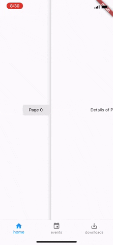

# Custom navigator

A flutter package that makes it easy to create your own navigator
anywhere in the widget tree.

A common use for such widget is when you need to implement an "Always presenting bottom navigation bar"



## Getting Started
First you need to add the package to your `pubspec.yaml` file.

### Custom scaffold

[CustomScaffold](https://github.com/ayham95/Custom-navigator/tree/master/custom_scaffold_example)
is a stateful widget that uses the [CustomNavigator](https://github.com/ayham95/Custom-navigator/tree/master/example) to to handle item
transition of [BottomNavigationBar] with nested navigation while keeping
the [BottomNavigationBar] visible!

#### Usage

```dart
// Here's the custom scaffold widget
// It takes a normal scaffold with mandatory bottom navigation bar
// and children who are your pages
CustomScaffold(
      scaffold: Scaffold(
        bottomNavigationBar: BottomNavigationBar(
          items: _items,
        ),
      ),

      // Children are the pages that will be shown by every click
      // They should placed in order such as
      // `page 0` will be presented when `item 0` in the [BottomNavigationBar] clicked.
      children: <Widget>[
        Page('0'),
        Page('1'),
        Page('2'),
      ],

      // Called when one of the [items] is tapped.
      onItemTap: (index) {},
    );
```

See the
[custom_scaffold_example](https://github.com/ayham95/Custom-navigator/tree/master/custom_scaffold_example)
for more details

_______
### Custom navigator 

The [CustomNavigator](https://github.com/ayham95/Custom-navigator/tree/master/example) is fairly easy to use


#### Usage

```dart

CustomNavigator(
        home: YourChildWidget(),
        //Specify your page route [PageRoutes.materialPageRoute] or [PageRoutes.cupertinoPageRoute]
        pageRoute: PageRoutes.materialPageRoute,
      );
```
Then you can call it using the same old `Navigator.of(context)`
#### Options
* you can specify Named routes exactly like in MaterialApp.

if you want to use the default [Navigator] you need to specify a
[GlobalKey] to your [MaterialApp] and use it `navigatorKey.currentState`

See the
[example](https://github.com/ayham95/Custom-navigator/tree/master/example)
for more details.